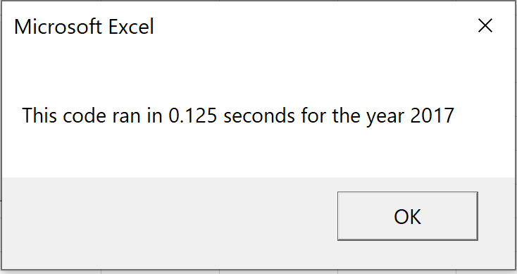

# Overview of Project

Steve promised his parents to look into DAQO stock but he is concerned about diversifying their funds. He wants to analyze a handful of green energy stocks in addition to DAQO stock. Steve created an Excel file containing the stocks to analyze. Using Visual Basic Application (VBA) we are using code to automate analyses so Steve can use it with any stock and reduces the chance of accidents and errors.
Steve loves the workbook you prepared for him. At the click of a button, he can analyze an entire dataset. Now, to do a little more research for his parents, he wants to expand the dataset to include the entire stock market over the last few years. Although the code works well for a dozen stocks, it might not work as well for thousands of stocks. And if it does, it may take a long time to execute. In this challenge we refactored the Module 2 solution code to loop through all the data one time in order to collect the same information in Module 2 solution. Then we determined whether refactoring the code successfully made the VBA script run faster.

# Results

The module 2 solution for stocks in 2017 ran for .79 seconds (View section All Stocks Analysis Runtimes) and the refactored code ran for .125 seconds (View section All Stocks Analysis Refactored Runtimes). The module 2 solution for stocks in 2018 ran for .78 seconds (View section All Stocks Analysis Runtimes) and the refactored code ran for .13 seconds (View section All Stocks Analysis Refactored Runtimes). In the "Sub All Stocks Analysis ()" we have a nested FOR loop (For i = 0 To 11, For j = 2 To RowCount), which repeats from the beginning to the end. The "Sub All Stock Analysis Refactored ()" has two separate FOR loops (For i = 0 To 11, For i = 2 To RowCount) which doesn’t repeat but continues from beginning to end. Hence, why the “Sub All Stocks Analysis Refactored ()” solution if faster than the “Sub All Stocks Analysis solution ()”. Both,“Sub All Stocks Analysis solution ()” and “Sub All Stocks Analysis Refactored ()”,  generate the same data which can be viewed Output Data For All Stocks 2017 and 2018 Section below.

## All Stocks Analysis Runtimes

## All Stocks Analysis Refactored Runtimes 

## Output Data For All Stocks 2017 and 2018

# Summary

Software normally fails when it becomes so complex that it can no longer provide the additional features needed while remaining error free. Refactoring is used to improve code design to make it easier to understand and extensible. If you believe a feature may be needed in the future and your current code won’t be easily able to accommodate you could refactor that code to make it easier to add that feature now rather than worrying about what you need to change with your code to add that feature later. By removing duplicate code, you remove the amount of code and hence the less code that you have the easier it is to modify as well as understand. Refactoring also helps you write code quicker, easier to read, eliminates duplication, makes modification easy, and minimizes complex digital logic. The disadvantages of refactoring code is that you might have to retest lots of functionality because it comes down to the quality of your continuous integration pipeline and your automated tests.

